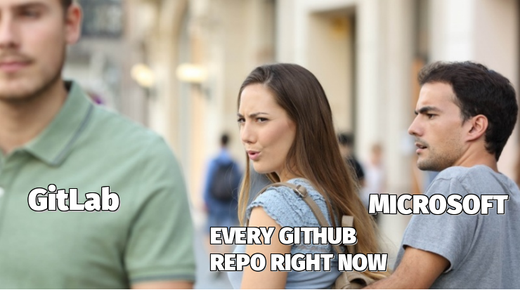

# GitHub has sold us out. This is the GitHub Evacuation Center.

Sold out.

Some will go with the flow. Some look forward to the new overlords and their deep pockets.

But some believe deeply that the open source community needs an independent home. Some believe that the concentration of so much power in the hands of so few is antithetical not just to free and open software, but also to a free and just society. We, the contributors and stargazers of this project are such people. This project is for us. **Star this repo** to count yourself in.

*#Resist*

## so, what's the goal?

The immediate goal is to be a sort of **GitHub Evacuation Center.** A space for evacuees to declare their status (in **protest** to GitHub, Microsoft and the world). A space to learn or share **escape routes** — In the coming days we will collaboratively put together resources and guides on where best to move you and your projects and how.

Long term the goal is to seed a resistance movement for a free, open and people-driven internet in service of a free, open and people-driven world.

## status update

**This is [the #1 trending repo](https://github.com/trending) on GitHub**, with 2,100 stars in its 3 days of existence. Traffic is growing exponentially with over 39,000 views and 12,000 visitors.

We are still figuring out a way to stay connected, to keep everyone updated. If you have ideas, please share. For now I recommend you put a watch on this repo. You can also follow [upend.org on twitter](https://twitter.com/UpEnd_org) or send an email to github.evacuees@upend.org.

As ironic as it may seem, it makes sense to keep this evacuation center right here on GitHub. For now at least. If they shut this down, it will only validate our exodus.

## how to help

A list of priority projects will appear right here in the coming days. In the meantime you can take a look at the issues and participate in the early discussions.

**Spread the word** within GitHub any way you can. Help people who'd want to be here find us. Outside GitHub: share, [tweet](https://twitter.com/intent/tweet?url=https%3A%2F%2Fgithub.com%2Fupend%2FIF_MS_BUYS_GITHUB_IMMA_OUT&text=Microsoft%20is%20trying%20to%20buy%20GitHub.%20Tell%20GitHub%20to%20%23resist.%20%23NeverMicrosoft.%20@upend%20the%20web%20oligarchy.) or post a link to this repo. You can also click the photo below to retweet it.

 

