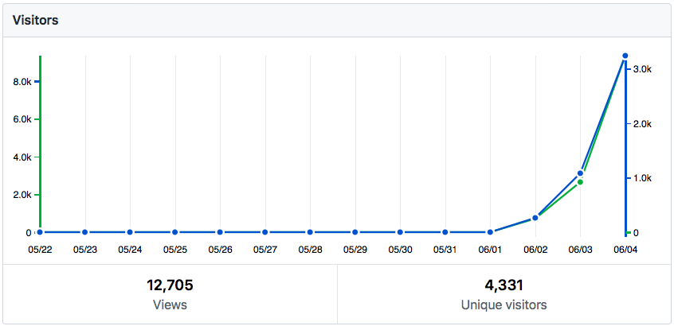
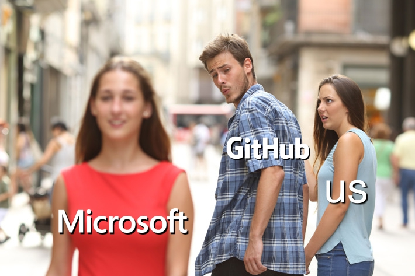

## status update

It looks like [a done deal](https://www.bloomberg.com/news/articles/2018-06-03/microsoft-is-said-to-have-agreed-to-acquire-coding-site-github). But GitHub selling us out is not the end, or even the beginning of the end. The world is the way it is because people give up too soon. #Resistance needs persistence and #solidarity. If not us, then whom?

**This repo is now [the 3rd highest trending repo](https://github.com/trending) on GitHub** and is about to surpass 1000 stars in only 2½ days of existence. Traffic is growing exponentially. Thanks to all of you spreading the word.

If you haven't already, please **star this repo**. Each star makes our voice louder, and helps other find us. **Spread the word** within GitHub any way you can. Outside GitHub: share, [tweet](https://twitter.com/intent/tweet?url=https%3A%2F%2Fgithub.com%2Fupend%2FIF_MS_BUYS_GITHUB_IMMA_OUT&text=Microsoft%20is%20trying%20to%20buy%20GitHub.%20Tell%20GitHub%20to%20%23resist.%20%23NeverMicrosoft.%20@upend%20the%20web%20oligarchy.) or post a link to this repo. Click the photo below to retweet it.

You all are from so many countries. I apologize if my language is too American and hard to follow. Let me know if I should re-word anything.

## but what's the goal?

The immediate goal is to be a sort of **GitHub Refugee Center.** A space for refugees to declare their status (in **protest** to GitHub, Microsoft and the world). A space to learn or share **escape routes** — the best places to move you and your projects to. (I'll create a page for that info, after I get some sleep!)

Long term the goal is to seed a resistance movement for a free, open and people-driven internet in service of a free, open and people-driven world.

## staying in the loop

I've got to figure out how we stay connected, how I can send updates. If you have ideas, let me know. 

Even though many of us (I hope all of us) will leave GitHub when we are able, some immediately, some only after they figure out the best alternative, it makes sense to keep this refugee camp right here on GitHub. It will serve as a line of communication to people still on GitHub. If they shut this down, it will only validate our exodus. So even if you want to cut out immediately and delete everything, **consider keeping at least a bare presence and association with this repo**, at least until we make camp elsewhere.

But you can also follow [upend.org on twitter](https://twitter.com/UpEnd_org). Or send an email to github.refugees@upend.org. 

## how to help

If you have a way with words, or other ideas to further the cause, please create an issue or a pull request. Or send me an email at the above address.

 

Click on this photo to retweet it:

